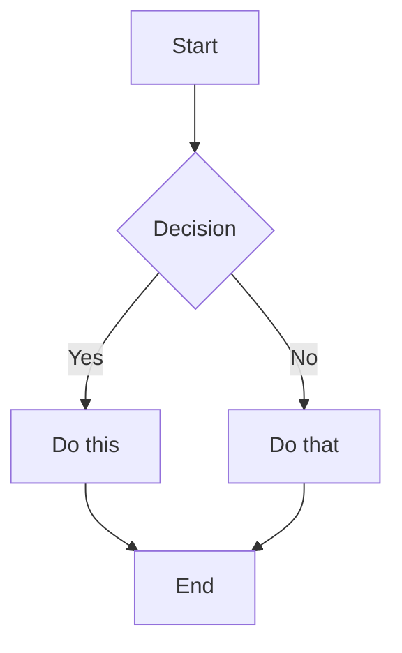
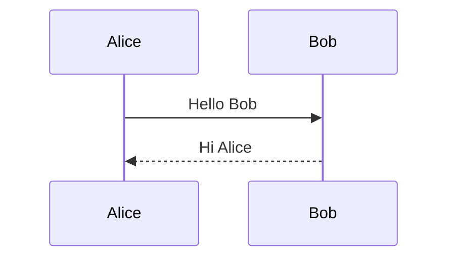
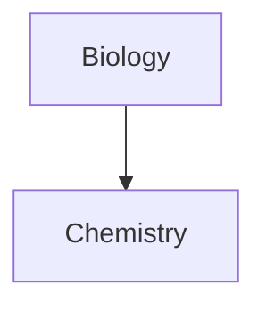
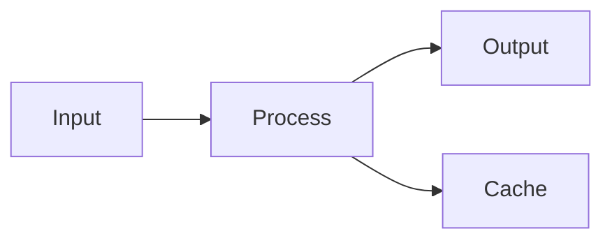

# Obsidian Flavored Markdown Skill

This skill enables Claude Code to create and edit valid Obsidian Flavored Markdown, including all Obsidian-specific syntax extensions.

## Overview

Obsidian uses a combination of Markdown flavors:
- [CommonMark](https://commonmark.org/)
- [GitHub Flavored Markdown](https://github.github.com/gfm/)
- [LaTeX](https://www.latex-project.org/) for math
- Obsidian-specific extensions (wikilinks, callouts, embeds, etc.)

## Basic Formatting

### Paragraphs and Line Breaks

```markdown
This is a paragraph.

This is another paragraph (blank line between creates separate paragraphs).

For a line break within a paragraph, add two spaces at the end  
or use Shift+Enter.
```

### Headings

```markdown
# Heading 1
## Heading 2
### Heading 3
#### Heading 4
##### Heading 5
###### Heading 6
```

### Text Formatting

| Style | Syntax | Example | Output |
|-------|--------|---------|--------|
| Bold | `**text**` or `__text__` | `**Bold**` | **Bold** |
| Italic | `*text*` or `_text_` | `*Italic*` | *Italic* |
| Bold + Italic | `***text***` | `***Both***` | ***Both*** |
| Strikethrough | `~~text~~` | `~~Striked~~` | ~~Striked~~ |
| Highlight | `==text==` | `==Highlighted==` | ==Highlighted== |
| Inline code | `` `code` `` | `` `code` `` | `code` |

### Escaping Formatting

Use backslash to escape special characters:
```markdown
\*This won't be italic\*
\#This won't be a heading
1\. This won't be a list item
```

Common characters to escape: `\*`, `\_`, `\#`, `` \` ``, `\|`, `\~`

## Internal Links (Wikilinks)

### Basic Links

```markdown
[[Note Name]]
[[Note Name.md]]
[[Note Name|Display Text]]
```

### Link to Headings

```markdown
[[Note Name#Heading]]
[[Note Name#Heading|Custom Text]]
[[#Heading in same note]]
[[##Search all headings in vault]]
```

### Link to Blocks

```markdown
[[Note Name#^block-id]]
[[Note Name#^block-id|Custom Text]]
```

Define a block ID by adding `^block-id` at the end of a paragraph:
```markdown
This is a paragraph that can be linked to. ^my-block-id
```

For lists and quotes, add the block ID on a separate line:
```markdown
> This is a quote
> With multiple lines

^quote-id
```

### Search Links

```markdown
[[##heading]]     Search for headings containing "heading"
[[^^block]]       Search for blocks containing "block"
```

## Markdown-Style Links

```markdown
[Display Text](Note%20Name.md)
[Display Text](Note%20Name.md#Heading)
[Display Text](https://example.com)
[Note](obsidian://open?vault=VaultName&file=Note.md)
```

Note: Spaces must be URL-encoded as `%20` in Markdown links.

## Embeds

### Embed Notes

```markdown
![[Note Name]]
![[Note Name#Heading]]
![[Note Name#^block-id]]
```

### Embed Images

```markdown
![[image.png]]
![[image.png|640x480]]    Width x Height
![[image.png|300]]        Width only (maintains aspect ratio)
```

### External Images

```markdown


```

### Embed Audio

```markdown
![[audio.mp3]]
![[audio.ogg]]
```

### Embed PDF

```markdown
![[document.pdf]]
![[document.pdf#page=3]]
![[document.pdf#height=400]]
```

### Embed Lists

```markdown
![[Note#^list-id]]
```

Where the list has been defined with a block ID:
```markdown
- Item 1
- Item 2
- Item 3

^list-id
```

### Embed Search Results

````markdown
```query
tag:#project status:done
```
````

## Callouts

### Basic Callout

```markdown
> [!note]
> This is a note callout.

> [!info] Custom Title
> This callout has a custom title.

> [!tip] Title Only
```

### Foldable Callouts

```markdown
> [!faq]- Collapsed by default
> This content is hidden until expanded.

> [!faq]+ Expanded by default
> This content is visible but can be collapsed.
```

### Nested Callouts

```markdown
> [!question] Outer callout
> > [!note] Inner callout
> > Nested content
```

### Supported Callout Types

| Type | Aliases | Description |
|------|---------|-------------|
| `note` | - | Blue, pencil icon |
| `abstract` | `summary`, `tldr` | Teal, clipboard icon |
| `info` | - | Blue, info icon |
| `todo` | - | Blue, checkbox icon |
| `tip` | `hint`, `important` | Cyan, flame icon |
| `success` | `check`, `done` | Green, checkmark icon |
| `question` | `help`, `faq` | Yellow, question mark |
| `warning` | `caution`, `attention` | Orange, warning icon |
| `failure` | `fail`, `missing` | Red, X icon |
| `danger` | `error` | Red, zap icon |
| `bug` | - | Red, bug icon |
| `example` | - | Purple, list icon |
| `quote` | `cite` | Gray, quote icon |

### Custom Callouts (CSS)

```css
.callout[data-callout="custom-type"] {
  --callout-color: 255, 0, 0;
  --callout-icon: lucide-alert-circle;
}
```

## Lists

### Unordered Lists

```markdown
- Item 1
- Item 2
  - Nested item
  - Another nested
- Item 3

* Also works with asterisks
+ Or plus signs
```

### Ordered Lists

```markdown
1. First item
2. Second item
   1. Nested numbered
   2. Another nested
3. Third item

1) Alternative syntax
2) With parentheses
```

### Task Lists

```markdown
- [ ] Incomplete task
- [x] Completed task
- [ ] Task with sub-tasks
  - [ ] Subtask 1
  - [x] Subtask 2
```

## Quotes

```markdown
> This is a blockquote.
> It can span multiple lines.
>
> And include multiple paragraphs.
>
> > Nested quotes work too.
```

## Code

### Inline Code

```markdown
Use `backticks` for inline code.
Use double backticks for ``code with a ` backtick inside``.
```

### Code Blocks

````markdown
```
Plain code block
```

```javascript
// Syntax highlighted code block
function hello() {
  console.log("Hello, world!");
}
```

```python
# Python example
def greet(name):
    print(f"Hello, {name}!")
```
````

### Nesting Code Blocks

Use more backticks or tildes for the outer block:

`````markdown
````markdown
Here's how to create a code block:
```js
console.log("Hello")
```
````
`````

## Tables

```markdown
| Header 1 | Header 2 | Header 3 |
|----------|----------|----------|
| Cell 1   | Cell 2   | Cell 3   |
| Cell 4   | Cell 5   | Cell 6   |
```

### Alignment

```markdown
| Left     | Center   | Right    |
|:---------|:--------:|---------:|
| Left     | Center   | Right    |
```

### Using Pipes in Tables

Escape pipes with backslash:
```markdown
| Column 1 | Column 2 |
|----------|----------|
| [[Link\|Display]] | ![[Image\|100]] |
```

## Math (LaTeX)

### Inline Math

```markdown
This is inline math: $e^{i\pi} + 1 = 0$
```

### Block Math

```markdown
$$
\begin{vmatrix}
a & b \\
c & d
\end{vmatrix} = ad - bc
$$
```

### Common Math Syntax

```markdown
$x^2$              Superscript
$x_i$              Subscript
$\frac{a}{b}$      Fraction
$\sqrt{x}$         Square root
$\sum_{i=1}^{n}$   Summation
$\int_a^b$         Integral
$\alpha, \beta$    Greek letters
```

## Diagrams (Mermaid)

````markdown

````

### Sequence Diagrams

````markdown

````

### Linking in Diagrams

````markdown

````

## Footnotes

```markdown
This sentence has a footnote[^1].

[^1]: This is the footnote content.

You can also use named footnotes[^note].

[^note]: Named footnotes still appear as numbers.

Inline footnotes are also supported.^[This is an inline footnote.]
```

## Comments

```markdown
This is visible %%but this is hidden%% text.

%%
This entire block is hidden.
It won't appear in reading view.
%%
```

## Horizontal Rules

```markdown
---
***
___
- - -
* * *
```

## Properties (Frontmatter)

Properties use YAML frontmatter at the start of a note:

```yaml
---
title: My Note Title
date: 2024-01-15
tags:
  - project
  - important
aliases:
  - My Note
  - Alternative Name
cssclasses:
  - custom-class
status: in-progress
rating: 4.5
completed: false
due: 2024-02-01T14:30:00
---
```

### Template Date Variables

**IMPORTANT:** In templates, always use dynamic date variables, never hardcoded dates.

```yaml
# ✓ CORRECT - uses template variable
created: "{{date}}"

# ✗ WRONG - hardcoded date will be wrong for all future notes
created: 2026-01-02
```

The `{{date}}` syntax works with Obsidian's core Templates plugin. For Templater, use `<% tp.date.now("YYYY-MM-DD") %>`.

### Property Types

| Type | Example |
|------|---------|
| Text | `title: My Title` |
| Number | `rating: 4.5` |
| Checkbox | `completed: true` |
| Date | `date: 2024-01-15` |
| Date & Time | `due: 2024-01-15T14:30:00` |
| List | `tags: [one, two]` or YAML list |
| Links | `related: "[[Other Note]]"` |

### Default Properties

- `tags` - Note tags
- `aliases` - Alternative names for the note
- `cssclasses` - CSS classes applied to the note

### Property Conventions

**Property names**: Use lowercase plural (categories, topics, authors, people)

**Property values**: Use Title Case for entries:
```yaml
topics:
  - "[[Career]]"      # ✓ Title Case
  - "[[Writing]]"     # ✓ Title Case
  - "[[career]]"      # ✗ lowercase
```

### People Detection

Notes named after people (e.g., "Howard Marks.md", "Bill Gurley - Notes.md") should include:
```yaml
categories:
  - "[[People]]"
person: "[[Howard Marks]]"
```

The `person` property links to the person's note for relationship mapping.

### Rating Scale (Kepano 1-7)

Use the kepano scale to rate note quality or content value:

| Rating | Meaning | Use for |
|--------|---------|---------|
| 7 | Perfect, life-changing | Profound insights, must revisit |
| 6 | Excellent, worth repeating | High-quality, substantial content |
| 5 | Good, enjoyable | Solid content with clear value |
| 4 | Passable, works in a pinch | Average notes, basic utility |
| 3 | Bad, don't do this | Poor quality, consider deleting |
| 2 | Atrocious, avoid | Very low value |
| 1 | Evil, harmful | Misleading or wrong information |

```yaml
rating: 6
```

Rating factors:
- Content length and depth
- Structure (headers, bullets, quotes)
- Topic quality (evergreen vs transient)
- Insight density (lessons, principles, frameworks)

### Topic Categories

When organizing notes, consider topic longevity:

**Evergreen topics** (lasting value - preserve):
- Wisdom, Ideas, Investing, AI, Crypto, Writing, Reading
- Philosophy, Psychology, Mental Models, Career
- Health, Fitness, Technology, Economics

**Transient topics** (time-bound - may become obsolete):
- ToDo, Projects, Wishlist, Travel
- Meeting-specific topics, dated events

## Vault Organization (Kepano Method)

### Folder Structure

Minimal folders, organized by authorship:

| Location | Content | Who wrote it |
|----------|---------|--------------|
| **Root** | Daily notes, personal notes, journals | You |
| **References** | Things that EXIST you write ABOUT | You (about external things) |
| **Clippings** | Things OTHERS WROTE you save | Others |
| **Attachments** | Images, PDFs, media | N/A |
| **Daily** | Daily notes (YYYY-MM-DD.md) | You |
| **Templates** | Note templates | N/A |

### Daily Notes (Kepano Method)

Daily notes serve as link targets - you don't write in them, they aggregate notes created on or linked to that date.

**File structure:**
- Location: `Daily/YYYY-MM-DD.md` (e.g., `Daily/2026-01-16.md`)
- Minimal content with embedded base view

**Daily Note Template:**
```yaml
---
tags:
  - daily
---
## Notes

![[Daily.base]]
```

**How it works:**
- The embedded `Daily.base` shows all notes where:
  - The `created` property matches the date
  - The filename contains the date (e.g., `2026-01-16 Meeting Notes.md`)
  - The note links to the daily note
- Daily notes are created automatically by Obsidian's Daily Notes plugin
- Configure in Settings → Daily notes: date format `YYYY-MM-DD`, folder `Daily`, template path

**Obsidian settings required:**
1. Enable Daily notes core plugin
2. Set date format: `YYYY-MM-DD`
3. Set new file location: `Daily`
4. Set template file: `Templates/Daily Note Template`

**The test:** Who wrote most of the words in the file?
- You → Root or References
- Someone else → Clippings

### References vs Clippings

**References** (things that exist you write about):
- Books, movies, places, people, podcasts (as entities)
- Mental models, quotes you curate
- Your notes ABOUT something external

**Clippings** (others' words you save):
- Articles, essays by others
- Tweet threads
- Kindle highlights (author's words)
- Podcast transcripts/clips (speaker's words)

### Readwise Imports

Readwise syncs highlights from various sources. Route by content type:

| Source | Content | Destination |
|--------|---------|-------------|
| Kindle highlights | Author's words | Clippings |
| Snipd podcast clips | Speaker's words | Clippings |
| Article highlights | Author's words | Clippings |
| Your book synthesis | Your thoughts | References |

### Category vs Topic Rule

**Category** = Has a template or Obsidian Base
- Use `categories` property with wikilinks

**Valid Categories:**
Clippings, Books, Podcasts, Podcast episodes, People, Quotes, Mental Models, Investments, Investing, Travel Inventory, Recipes, Camera Gear, Coffee Tasting Log, Midjourney, Plants, Physical Assets, IDs & Certificates, Companies, Contacts, Events, Meetings, Projects, Crypto

**Topic** = No template, thematic grouping
- Use `topics` property with wikilinks

**Common Topics:**
AI, Business, Programming, Productivity, Venture Capital, KPMG, DeFi, Stocks, Macro, Fiction, Non-Fiction, Writing, Wisdom, Personal Growth, Technology, Philosophy, Health, History, Geopolitics, Economics, Psychology, Leadership, Energy, China

### Pragmatic Exceptions

Some folders may break minimal-folder rules for practical reasons:
- **Website folder**: Published content (like Kepano's separate vault)
- **Admin folders**: Sensitive docs (Health, Work, Personal Finance)

## Tags

```markdown
#tag
#nested/tag
#tag-with-dashes
#tag_with_underscores

In frontmatter:
---
tags:
  - tag1
  - nested/tag2
---
```

Tags can contain:
- Letters (any language)
- Numbers (not as first character)
- Underscores `_`
- Hyphens `-`
- Forward slashes `/` (for nesting)

## HTML Content

Obsidian supports HTML within Markdown:

```markdown
<div class="custom-container">
  <span style="color: red;">Colored text</span>
</div>

<details>
  <summary>Click to expand</summary>
  Hidden content here.
</details>

<kbd>Ctrl</kbd> + <kbd>C</kbd>
```

## Complete Example

````markdown
---
title: Project Alpha
date: 2024-01-15
tags:
  - project
  - active
status: in-progress
priority: high
---

# Project Alpha

## Overview

This project aims to [[improve workflow]] using modern techniques.

> [!important] Key Deadline
> The first milestone is due on ==January 30th==.

## Tasks

- [x] Initial planning
- [x] Resource allocation
- [ ] Development phase
  - [ ] Backend implementation
  - [ ] Frontend design
- [ ] Testing
- [ ] Deployment

## Technical Notes

The main algorithm uses the formula $O(n \log n)$ for sorting.

```python
def process_data(items):
    return sorted(items, key=lambda x: x.priority)
```

## Architecture



## Related Documents

- ![[Meeting Notes 2024-01-10#Decisions]]
- [[Budget Allocation|Budget]]
- [[Team Members]]

## References

For more details, see the official documentation[^1].

[^1]: https://example.com/docs

%%
Internal notes:
- Review with team on Friday
- Consider alternative approaches
%%
````

## Meeting Note Format

A common pattern for meeting notes in Obsidian:

### YAML Frontmatter

```yaml
---
categories:
  - "[[Meetings]]"
type: "[[Meetings]]"
date: 2024-01-15
time: "10:00"
location: "Zoom"
attendees:
  - "[[Person One]]"
  - "[[Person Two]]"
  - "External Person Name"
topics:
  - "[[Topic One]]"
  - "[[Topic Two]]"
workstream: Revenue
---
```

**Key points:**
- Attendees with vault entries use wikilinks; external attendees use plain text
- Topics link to concept/category notes in the vault
- Date uses ISO format (YYYY-MM-DD), time in quotes

### Standard Sections

```markdown
## About Meeting

**Date & Time**: 15 Jan 2024, 10:00 AM
**Location**: Zoom
**Attendees**: [[Person One]], [[Person Two]], External Person

## Meeting Outline

1. First agenda item
2. Second agenda item
3. Third agenda item

## Overview

Summary of what was discussed and key outcomes.

### Subsection for Major Topic

Details about specific discussion point.

## Action Items

| Action | Owner | Deliverable |
|--------|-------|-------------|
| Do something | [[Person One]] | Output description |
| Do another thing | [[Person Two]] | Another output |

## Decisions

1. First decision made
2. Second decision made
```

### Synergy/Project Bucket Links

When meetings discuss specific workstreams or project buckets, add a `synergy_buckets` property:

```yaml
synergy_buckets:
  - "[[Bucket-02 - RBW Jade]]"
  - "[[Bucket-04 - CMB Jade]]"
  - "[[Bucket-06 - Payments]]"
```

This enables bidirectional linking between meetings and the documents they inform.

### Raw Transcript Processing

When summarizing raw transcripts (e.g., from Otter.ai or similar), extract content into:

```markdown
## Key Themes

Overview of main topics covered across the session(s).

---

## Meeting 1: [Topic Name]

### Subsection

Content organized by logical groupings.

| Data | Presented | In Tables |
|------|-----------|-----------|

---

## Key Decisions Made

| # | Decision | Rationale |
|---|----------|-----------|
| 1 | Decision text | Why this was decided |
| 2 | Another decision | Reasoning |

---

## Open Issues for Resolution

| # | Issue | Owner | Status |
|---|-------|-------|--------|
| 1 | Issue description | [[Person]] | 🔴 Critical |
| 2 | Another issue | [[Person]] | 🟡 In progress |

---

## Action Items

| # | Action | Owner | Due |
|---|--------|-------|-----|
| 1 | Action description | [[Person]] | Date/ASAP |

---

## Key Quotes

> "Verbatim quote from the meeting" - **Speaker Name**

---

## Raw Transcript

*The raw transcript has been archived. Key content has been extracted above.*
```

### Meeting Cross-References

When updating project documents (bucket files, synergy cases, etc.) with meeting content:

**Use `<u>` tags to mark new additions from recent meetings:**

```markdown
### <u>2024-01-16 Project Review Meeting</u>

<u>Per [[2024-01-16 Project Review Meeting]]:</u>

<u>**Key Finding:**</u>
<u>- Bullet point from meeting</u>
<u>- Another finding</u>

<u>**Decision Made:**</u>
<u>| Column 1 | Column 2 |</u>
<u>|----------|----------|</u>
<u>| Data | Value |</u>
```

This pattern:
- Visually distinguishes recent additions from original content
- Provides audit trail of when content was added
- Links back to source meeting for context
- Uses underline (`<u>`) rather than bold/italic to avoid conflict with existing formatting

## Batch Wikilink Addition

When systematically adding backlinks across multiple files:

### Rules

1. **First occurrence only** (Kepano method) - Link only the first mention of each term per file
2. **Skip YAML frontmatter** - Don't add links between `---` markers
3. **Don't double-link** - Skip terms already in `[[wikilinks]]`
4. **Whole word matching** - Don't link "CMB" inside "CMBank"

### Display Name Syntax for People

When linking first names that appear alone:

```markdown
Omar mentioned...        → [[Omar Malik|Omar]] mentioned...
Rob confirmed...         → [[Rob Wall|Rob]] confirmed...
```

### Normalizing Variations

Link common variations to their canonical note:

```markdown
Pathfinder project...    → [[Project Pathfinder]] project...
the Skyline work...      → the [[Project Skyline]] work...
Cedar integration...     → [[Project Cedar]] integration...
```

### Valid Link Targets

Check the vault's bases/indexes for valid link targets:
- **People/** folder or People.base
- **Concepts/** folder or Concepts.base
- **Business Lines/** or similar reference folders

### Processing Large Vaults

For vaults with many files:
1. Extract all valid link targets from bases/indexes
2. Process files in batches by folder
3. Track which files were modified and what links were added

## Vault-Specific Configuration

**Always check for a vault-level CLAUDE.md** before processing files. Vault CLAUDE.md may define:

- Custom taxonomy (categories, topics, types)
- Vault-specific properties and their allowed values
- Valid link targets from the vault's bases
- Naming conventions for files and properties
- Project-specific terms and their canonical forms

The vault CLAUDE.md takes precedence over general Obsidian conventions.

## Vault Maintenance

When reorganizing vaults (moving, archiving, or deleting files), maintain link integrity:

### After Moving Files

1. **Find incoming links** - Search for `[[Moved File Name]]` across the vault
2. **Update or remove** - Fix wikilinks in files that referenced the moved content
3. **Check aliases** - If the file had aliases, search for those too

### Archive vs Delete

**Prefer archiving** over deletion for superseded content:
- Move to an `Archive/` folder rather than delete
- Preserves historical context and audit trail
- Allows recovery if needed later

```
Vault/
├── Active Files/
└── Archive/
    └── Superseded - 2024-01/
        └── Old File.md
```

### Link Maintenance Patterns

| Scenario | Action |
|----------|--------|
| File renamed | Update all `[[Old Name]]` → `[[New Name]]` |
| File moved to Archive | Update links to point to new location, or replace with current equivalent |
| File deleted | Remove or replace broken links |
| File superseded | Update links to point to replacement file |

### Finding Stale Links

After reorganization, search for:
- Links to archived files that should point elsewhere
- Orphan links (files with no incoming links that may be obsolete)
- Related Documents sections that reference old structure

### Bulk Renumbering Pattern

When files have numeric IDs (e.g., `Bucket-08`, `SYN-05`) and need renumbering:

1. **Rename files** - Update filename to new number
2. **Update frontmatter** - Change `bucket_id`, `synergy_id`, or similar property
3. **Update internal references** - Change heading numbers, table references within the file
4. **Update cross-references** - Search vault for `[[Old Name]]` and update to `[[New Name]]`
5. **Update CLAUDE.md** - If vault has structure tables, update bucket/synergy listings

**Workflow:**
```bash
# 1. Rename files (bash)
mv "Bucket-08 - Old Name.md" "Bucket-10 - Old Name.md"

# 2-3. Edit file content (use Edit tool)
# - bucket_id: "Bucket-10"
# - # Bucket 10: Title

# 4. Search for cross-references
# Use Grep to find [[Bucket-08 or "Bucket 8" references

# 5. Update vault CLAUDE.md structure tables
```

**Common patterns requiring updates:**
- Frontmatter ID properties (`bucket_id`, `synergy_id`)
- H1 headings (`# Bucket 8:` → `# Bucket 10:`)
- Framework Context sections (`> **Bucket 8** in the...`)
- Relationship tables (`| **Bucket 8** | ...`)
- Scorecard tables across multiple files

## Batch Vault Operations

When updating multiple files with consistent formatting (e.g., adding Meeting Cross-References sections to project bucket files):

### Pattern: Cross-Reference Enrichment

1. **Read the example file** - Identify the target format from an existing well-structured file
2. **Inventory files to update** - Glob for all files matching the pattern (e.g., `Cost Synergies/*.md`)
3. **Inventory source files** - Glob for all meeting files or other sources to extract from
4. **Map relationships** - Identify which sources are relevant to which target files
5. **Apply consistent formatting** - Add sections with proper wikilinks and structure

### Using Parallel Agents

For vaults with many files (>5 target files), dispatch parallel Sonnet agents grouped by theme or folder:

```
Agent 1: C01-C05 (Business line buckets)
Agent 2: C06-C09 (CIB-related buckets)
Agent 3: C10-C14 (Technology/support functions)
...
```

**Benefits:**
- Reduces token usage (Sonnet vs Opus for mechanical tasks)
- Parallel execution speeds up processing
- Each agent focuses on related files for better context

**Agent prompt template:**
```
You are updating [file type] files in [vault path] with [content type].

Your files to update:
- [list of file paths]

Source folder: [path to source files]

Task:
1. Read each target file
2. Read ALL source files
3. For each target, identify relevant sources
4. Add a "## [Section Name]" section using this format:
   [example format]

Important:
- Use wikilinks for people and file references
- Include specific quotes using > blockquote format
- Only include genuinely relevant content
```

### Quality Checks

After batch operations:
- Spot-check 2-3 files from different groups
- Verify wikilink syntax is correct
- Confirm formatting matches the example file
- Check that content is substantive, not generic summaries

## References

- [Basic formatting syntax](https://help.obsidian.md/syntax)
- [Advanced formatting syntax](https://help.obsidian.md/advanced-syntax)
- [Obsidian Flavored Markdown](https://help.obsidian.md/obsidian-flavored-markdown)
- [Internal links](https://help.obsidian.md/links)
- [Embed files](https://help.obsidian.md/embeds)
- [Callouts](https://help.obsidian.md/callouts)
- [Properties](https://help.obsidian.md/properties)

